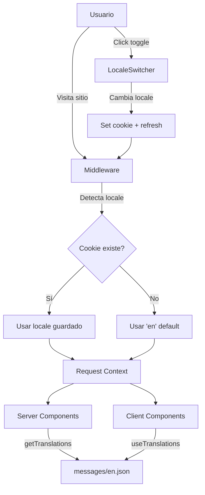

# Plan de Implementación de Internacionalización (i18n)
## geroserial.com - Sistema de Traducción Español/Inglés

---

## 📋 Tabla de Contenidos

1. [Introducción y Análisis del Desafío](#1-introducción-y-análisis-del-desafío)
2. [Análisis de Tecnologías y Herramientas](#2-análisis-de-tecnologías-y-herramientas)
3. [Arquitectura Técnica Propuesta](#3-arquitectura-técnica-propuesta)
4. [Flujo de Implementación por Etapas](#4-flujo-de-implementación-por-etapas)
5. [Consideraciones Técnicas Especiales](#5-consideraciones-técnicas-especiales)
6. [Recomendaciones Finales y Próximos Pasos](#6-recomendaciones-finales-y-próximos-pasos)

---

## 1. Introducción y Análisis del Desafío

### 1.1 Contexto del Proyecto

**Stack técnico actual:**
- **Framework:** Next.js 16.0.1 (App Router)
- **React:** 19.2.0
- **Animaciones:** GSAP 3.13.0 + Motion 12.23.24
- **Estilos:** Tailwind CSS 3.4.18
- **Tema:** next-themes 0.4.6
- **Package Manager:** pnpm

**Estructura del sitio:**
```
├── / (página principal - SPA con 6 secciones)
│   ├── Hero
│   ├── Services
│   ├── Process
│   ├── Projects
│   ├── Results
│   └── Contact
│
└── /portfolio (página currículum)
    ├── About
    ├── Skills
    ├── Experience
    ├── Education
    ├── Projects
    ├── Resume Download
    └── Contact Opportunities
```

**Contenido a traducir:**
- ~15-20 componentes React
- ~20 proyectos en `data/projects.json` (NO usa MDX)
- Metadata SEO (títulos, descripciones)
- Configuración de navegación
- Mensajes de UI y formularios

### 1.2 Requerimientos Clave

| Requerimiento | Descripción | Prioridad |
|--------------|-------------|-----------|
| **Sin geolocalización** | Toggle manual usuario-controlado | 🔴 Crítica |
| **Idioma por defecto** | Inglés como principal | 🔴 Crítica |
| **Persistencia** | Guardar preferencia del usuario | 🟡 Alta |
| **SEO bilingüe** | Meta tags y URLs alternativas | 🟡 Alta |
| **Accesibilidad** | ARIA labels, lang attributes | 🟡 Alta |
| **Performance** | Zero bundle size increase inicial | 🟢 Media |
| **Escalabilidad** | Fácil agregar más idiomas | 🟢 Media |

### 1.3 Desafíos Identificados

1. **Proyectos JSON:** 20 proyectos en `data/projects.json` requieren estructura bilingüe
2. **Tema dual:** Textos deben adaptarse a light/dark mode
3. **Navegación animada:** Labels dinámicos con animaciones GSAP
4. **SEO sin rutas:** Mantener URLs sin `/es/` o `/en/`
5. **Persistencia:** Guardar preferencia entre sesiones

> **✅ NOTA IMPORTANTE:** Las animaciones GSAP NO requieren modificación. Los selectores CSS (`.hero-title`, `.gsap-element`, etc.) permanecen iguales independientemente del idioma. Solo cambia el contenido textual dentro de los elementos.

---

## 2. Análisis de Tecnologías y Herramientas

### 2.1 Comparativa de Soluciones de i18n

#### Opción A: next-intl (Recomendada ⭐)

**Características:**
- Diseñado específicamente para Next.js 13+ App Router
- Soporte nativo para Server Components
- Type-safe con TypeScript
- Locale routing opcional (se puede desactivar)
- ~7KB gzipped

**Pros:**
- ✅ Integración perfecta con App Router
- ✅ No requiere rutas `/[locale]` (configurable)
- ✅ Excelente DX con TypeScript
- ✅ Soporta formato ICU para plurales/variables
- ✅ Hooks para Client Components (`useTranslations`)
- ✅ Funciones para Server Components (`getTranslations`)
- ✅ SEO-friendly con `NextIntlClientProvider`

**Contras:**
- ⚠️ Curva de aprendizaje media
- ⚠️ Requiere reestructuración de archivos si usas locale routing

**Instalación:**
```bash
pnpm add next-intl
```

**Configuración básica (sin rutas):**
```typescript
// middleware.ts
import createMiddleware from 'next-intl/middleware';
 
export default createMiddleware({
  locales: ['en', 'es'],
  defaultLocale: 'en',
  localePrefix: 'never' // NO agrega /en o /es a las URLs
});
 
export const config = {
  matcher: ['/((?!api|_next|_vercel|.*\\..*).*)']
};
```

---

#### Opción B: next-i18next

**Características:**
- Basado en react-i18next
- Popular en Next.js Pages Router
- ~20KB gzipped

**Pros:**
- ✅ Ecosistema maduro
- ✅ Muchos plugins y herramientas

**Contras:**
- ❌ Principalmente diseñado para Pages Router
- ❌ Soporte limitado para Server Components
- ❌ Configuración más compleja
- ❌ Bundle size mayor

**Veredicto:** No recomendado para App Router moderno

---

#### Opción C: react-intl (Formatjs)

**Características:**
- Solución agnóstica de framework
- Poderoso sistema de formateo
- ~15KB gzipped

**Pros:**
- ✅ Altamente flexible
- ✅ Formateo avanzado de fechas/números

**Contras:**
- ❌ No optimizado para Next.js
- ❌ Requiere Context manual
- ❌ No aprovecha Server Components
- ❌ Bundle size mayor

**Veredicto:** Overkill para este proyecto

---

#### Opción D: Solución Custom (i18n Nativo)

**Implementación manual:**
```typescript
// lib/i18n.ts
export const translations = {
  en: {
    'hero.title': 'IT Specialist',
    // ...
  },
  es: {
    'hero.title': 'Especialista en TI',
    // ...
  }
};

export function t(key: string, locale: string) {
  return translations[locale][key] || key;
}
```

**Pros:**
- ✅ Control total
- ✅ Zero dependencies
- ✅ Bundle size mínimo

**Contras:**
- ❌ Falta de type-safety
- ❌ Sin formateo avanzado
- ❌ Mantenimiento manual
- ❌ Sin tooling (linter, extractor)

**Veredicto:** Viable para MVP, no escalable

---

### 2.2 Tabla Comparativa Final

| Criterio | next-intl | next-i18next | react-intl | Custom |
|----------|-----------|--------------|------------|--------|
| **App Router** | ⭐⭐⭐⭐⭐ | ⭐⭐ | ⭐⭐⭐ | ⭐⭐⭐⭐ |
| **Type Safety** | ⭐⭐⭐⭐⭐ | ⭐⭐⭐ | ⭐⭐⭐⭐ | ⭐⭐ |
| **Bundle Size** | ⭐⭐⭐⭐⭐ | ⭐⭐⭐ | ⭐⭐⭐ | ⭐⭐⭐⭐⭐ |
| **DX** | ⭐⭐⭐⭐⭐ | ⭐⭐⭐⭐ | ⭐⭐⭐ | ⭐⭐ |
| **Escalabilidad** | ⭐⭐⭐⭐⭐ | ⭐⭐⭐⭐ | ⭐⭐⭐⭐ | ⭐⭐ |
| **SEO** | ⭐⭐⭐⭐⭐ | ⭐⭐⭐⭐ | ⭐⭐⭐ | ⭐⭐⭐ |
| **Documentación** | ⭐⭐⭐⭐⭐ | ⭐⭐⭐⭐ | ⭐⭐⭐⭐ | N/A |

### 2.3 Decisión Técnica

**✅ SOLUCIÓN RECOMENDADA: next-intl**

**Justificación:**
1. Diseño nativo para Next.js 13+ App Router
2. Configuración `localePrefix: 'never'` elimina rutas con locale
3. Type-safe con autocomplete
4. Bundle size óptimo
5. Soporte completo para Server + Client Components
6. Mantenimiento activo y comunidad robusta

---

## 3. Arquitectura Técnica Propuesta

### 3.1 Estructura de Archivos

```
portfolio/
├── messages/                       # Traducciones JSON
│   ├── en.json                    # Inglés (default)
│   └── es.json                    # Español
│
├── app/
│   ├── [locale]/                  # Opcional: Solo si decides usar rutas
│   │   ├── layout.tsx
│   │   └── page.tsx
│   │
│   ├── _components/               # Componentes existentes
│   │   ├── Hero.tsx              # Usar useTranslations()
│   │   ├── Services.tsx
│   │   └── ...
│   │
│   └── portfolio/
│       ├── page.tsx
│       └── _components/
│
├── components/
│   ├── layout/
│   │   ├── AnimatedNav.tsx       # Agregar LocaleSwitcher
│   │   └── LocaleSwitcher.tsx    # NUEVO: Toggle EN/ES
│   │
│   └── providers/
│       └── LocaleProvider.tsx    # NUEVO: Wrap con NextIntlClientProvider
│
├── lib/
│   ├── i18n/
│   │   ├── config.ts             # Configuración de locales
│   │   ├── request.ts            # getRequestConfig para next-intl
│   │   └── types.ts              # TypeScript types
│   │
│   └── utils.ts
│
├── data/
│   ├── projects.json             # Proyectos con estructura bilingüe
│   └── README.md
│
├── middleware.ts                 # NUEVO: next-intl middleware
├── i18n.ts                       # NUEVO: Configuración raíz
└── next.config.mjs               # Actualizar para i18n
```

### 3.2 Flujo de Datos



### 3.3 Configuración Detallada

#### 3.3.1 Middleware (Sin rutas localizadas)

```typescript
// middleware.ts
import createMiddleware from 'next-intl/middleware';
import { locales, defaultLocale } from './lib/i18n/config';

export default createMiddleware({
  locales,
  defaultLocale,
  localePrefix: 'never', // URLs sin /en o /es
  localeDetection: false // Deshabilitar auto-detección
});

export const config = {
  matcher: [
    '/((?!api|_next|_vercel|.*\\..*).*)',
    '/portfolio/:path*'
  ]
};
```

#### 3.3.2 Configuración i18n Raíz

```typescript
// i18n.ts
import { notFound } from 'next/navigation';
import { getRequestConfig } from 'next-intl/server';
import { locales } from './lib/i18n/config';

export default getRequestConfig(async ({ locale }) => {
  // Validar locale
  if (!locales.includes(locale as any)) notFound();

  return {
    messages: (await import(`./messages/${locale}.json`)).default
  };
});
```

#### 3.3.3 Layout Raíz Actualizado

```typescript
// app/layout.tsx
import { NextIntlClientProvider } from 'next-intl';
import { getMessages, getLocale } from 'next-intl/server';

export default async function RootLayout({
  children,
}: {
  children: React.ReactNode;
}) {
  const locale = await getLocale();
  const messages = await getMessages();

  return (
    <html lang={locale} suppressHydrationWarning>
      <body>
        <NextIntlClientProvider messages={messages}>
          <ThemeProvider>
            <AnimatedNav />
            {children}
          </ThemeProvider>
        </NextIntlClientProvider>
      </body>
    </html>
  );
}
```

### 3.4 Componente LocaleSwitcher

```typescript
// components/layout/LocaleSwitcher.tsx
'use client';

import { useLocale } from 'next-intl';
import { useRouter, usePathname } from 'next/navigation';
import { Languages } from 'lucide-react';

const LOCALES = {
  en: { label: 'English', flag: '🇺🇸' },
  es: { label: 'Español', flag: '🇪🇸' }
} as const;

export function LocaleSwitcher() {
  const locale = useLocale();
  const router = useRouter();
  const pathname = usePathname();

  const toggleLocale = () => {
    const newLocale = locale === 'en' ? 'es' : 'en';
    
    // Guardar en cookie
    document.cookie = `NEXT_LOCALE=${newLocale}; path=/; max-age=31536000`;
    
    // Refresh para aplicar cambio
    router.refresh();
  };

  return (
    <button
      onClick={toggleLocale}
      className="p-2 rounded-lg hover:bg-zinc-100 dark:hover:bg-zinc-800 
                 transition-colors duration-200 group"
      aria-label={`Switch to ${locale === 'en' ? 'Spanish' : 'English'}`}
    >
      <div className="flex items-center gap-2">
        <Languages className="w-5 h-5" />
        <span className="text-sm font-medium">
          {LOCALES[locale === 'en' ? 'es' : 'en'].flag}
        </span>
      </div>
    </button>
  );
}
```

### 3.5 Estructura de Mensajes JSON

```json
// messages/en.json
{
  "nav": {
    "home": "Home",
    "services": "Services",
    "process": "Process",
    "projects": "Projects",
    "results": "Results",
    "contact": "Contact",
    "portfolio": "Portfolio"
  },
  "hero": {
    "title": "geroserial.com",
    "subtitle": "IT Specialist · Infrastructure, Automation & Web Systems Management",
    "description": "Methodical Approach. Real-World Solutions.",
    "cta": "View Services"
  },
  "services": {
    "title": "Services",
    "subtitle": "Specialized technical solutions",
    "items": {
      "web": {
        "title": "Web Development",
        "description": "Modern web applications with React and Next.js"
      }
      // ... más servicios
    }
  },
  "meta": {
    "home": {
      "title": "geroserial.com",
      "description": "Providing technological solutions that simplify and enhance projects."
    },
    "portfolio": {
      "title": "Portfolio | Geronimo Serial",
      "description": "Complete portfolio and resume for Geronimo Serial"
    }
  }
}
```

```json
// messages/es.json
{
  "nav": {
    "home": "Inicio",
    "services": "Servicios",
    "process": "Proceso",
    "projects": "Proyectos",
    "results": "Resultados",
    "contact": "Contacto",
    "portfolio": "Portafolio"
  },
  "hero": {
    "title": "geroserial.com",
    "subtitle": "Especialista en TI · Infraestructura, Automatización y Gestión de Sistemas Web",
    "description": "Enfoque Metódico. Soluciones del Mundo Real.",
    "cta": "Ver Servicios"
  },
  // ... resto de traducciones
}
```

---

## 4. Flujo de Implementación por Etapas

### 4.1 FASE 1: Configuración Base (2-3 días)

#### 4.1.1 Instalación y Setup Inicial

**Tareas:**
1. Instalar dependencias
2. Crear estructura de archivos
3. Configurar middleware
4. Setup TypeScript types

**Comandos:**
```bash
# 1. Instalar next-intl
pnpm add next-intl

# 2. Crear directorios
mkdir -p messages lib/i18n content/projects/en content/projects/es

# 3. Crear archivos base
touch middleware.ts i18n.ts
touch lib/i18n/config.ts lib/i18n/types.ts
touch messages/en.json messages/es.json
```

**Archivos a crear:**

```typescript
// lib/i18n/config.ts
export const locales = ['en', 'es'] as const;
export const defaultLocale = 'en';
export type Locale = (typeof locales)[number];

export const localeNames: Record<Locale, string> = {
  en: 'English',
  es: 'Español'
};
```

```typescript
// lib/i18n/types.ts
import type en from '@/messages/en.json';

export type Messages = typeof en;
export type IntlMessages = Messages;

declare global {
  interface IntlMessages extends Messages {}
}
```

**Actualizar next.config.mjs:**
```javascript
import createNextIntlPlugin from 'next-intl/plugin';

const withNextIntl = createNextIntlPlugin('./i18n.ts');

/** @type {import('next').NextConfig} */
const nextConfig = {
  // ... configuración existente
};

export default withNextIntl(nextConfig);
```

**Actualizar tsconfig.json:**
```json
{
  "compilerOptions": {
    "plugins": [
      {
        "name": "next-intl/plugin"
      }
    ]
  }
}
```

#### 4.1.2 Testing de Configuración

```bash
# Verificar que el build funcione
pnpm build

# Iniciar dev server
pnpm dev
```

**Checklist:**
- [ ] No hay errores de TypeScript
- [ ] Middleware se ejecuta correctamente
- [ ] Cookies se establecen
- [ ] Provider envuelve la app

---

### 4.2 FASE 2: Traducción de Página Principal (3-4 días)

#### 4.2.1 Navegación

**Actualizar AnimatedNav.tsx:**
```typescript
// components/layout/AnimatedNav.tsx
'use client';

import { useTranslations } from 'next-intl';
import { LocaleSwitcher } from './LocaleSwitcher';

export default function AnimatedNav() {
  const t = useTranslations('nav');
  
  // Obtener items de navegación con traducciones
  const navItems = [
    { id: 'services', label: t('services') },
    { id: 'process', label: t('process') },
    { id: 'projects', label: t('projects') },
    { id: 'results', label: t('results') },
    { id: 'contact', label: t('contact') },
  ];

  return (
    <nav className="...">
      {/* ... código existente ... */}
      
      {/* Agregar LocaleSwitcher */}
      <div className="flex items-center gap-3">
        <LocaleSwitcher />
        <ThemeToggle />
        <a href={SITE_CONFIG.links.github}>
          <Github />
        </a>
      </div>
    </nav>
  );
}
```

#### 4.2.2 Sección Hero

**Actualizar Hero.tsx:**
```typescript
// app/_components/Hero.tsx
'use client';

import { useTranslations } from 'next-intl';

export default function Hero() {
  const t = useTranslations('hero');

  return (
    <section id="hero" className="...">
      <GradientHeading>{t('title')}</GradientHeading>
      
      <h2 className="...">{t('subtitle')}</h2>
      
      <p className="...">{t('description')}</p>
      
      <Button onClick={() => scrollTo('services')}>
        {t('cta')}
      </Button>
    </section>
  );
}
```

#### 4.2.3 Secciones Restantes

**Patrón a seguir:**
1. Importar `useTranslations` en cada componente
2. Definir namespace (`'services'`, `'process'`, etc.)
3. Reemplazar strings hardcodeados con `t('key')`
4. Agregar keys al JSON

**Ejemplo Services.tsx:**
```typescript
'use client';

import { useTranslations } from 'next-intl';

export default function Services() {
  const t = useTranslations('services');

  const services = [
    {
      icon: <Code className="w-8 h-8" />,
      title: t('items.web.title'),
      description: t('items.web.description')
    },
    // ... más servicios
  ];

  return (
    <section id="services">
      <h2>{t('title')}</h2>
      <p>{t('subtitle')}</p>
      {/* ... */}
    </section>
  );
}
```

#### 4.2.4 Metadata SEO

**Actualizar app/layout.tsx:**
```typescript
import { getTranslations } from 'next-intl/server';

export async function generateMetadata() {
  const t = await getTranslations('meta.home');

  return {
    title: {
      default: t('title'),
      template: `%s | ${t('title')}`
    },
    description: t('description'),
    openGraph: {
      title: t('title'),
      description: t('description'),
      locale: 'en_US', // o dinámico
      alternateLocale: 'es_ES'
    }
  };
}
```

---

### 4.3 FASE 3: Proyectos JSON (1-2 días)

> **✅ ACLARACIÓN:** El proyecto usa `data/projects.json` (no MDX), lo que simplifica significativamente esta fase.

#### 4.3.1 Reestructurar projects.json

**Opción A: Estructura con objetos bilingües (Recomendada)**

```json
// data/projects.json
[
  {
    "title": {
      "en": "@chronark/access",
      "es": "@chronark/access"
    },
    "description": {
      "en": "A minimal library for access control. It is designed to be used together with opaque access tokens...",
      "es": "Una librería minimalista para control de acceso. Diseñada para usarse junto con tokens de acceso opacos..."
    },
    "repository": "chronark/access",
    "date": "2022-11-13",
    "published": true,
    "slug": "access"
  },
  {
    "title": {
      "en": "chronark.com",
      "es": "chronark.com"
    },
    "description": {
      "en": "The website you're looking at",
      "es": "El sitio web que estás viendo"
    },
    "repository": "chronark/chronark.com",
    "url": "https://chronark.com",
    "date": "2023-03-28",
    "published": true,
    "slug": "chronark.com"
  }
  // ... resto de proyectos
]
```

**Opción B: Dos archivos separados (Alternativa)**

```
data/
├── projects.en.json  # Todos los proyectos en inglés
└── projects.es.json  # Todos los proyectos en español
```

#### 4.3.2 Crear Helper para Proyectos

```typescript
// lib/projects.ts
import { Locale } from './i18n/config';
import projectsData from '@/data/projects.json';

export interface Project {
  title: string;
  description: string;
  repository?: string;
  url?: string;
  date?: string;
  published: boolean;
  slug: string;
}

interface ProjectData {
  title: Record<Locale, string>;
  description: Record<Locale, string>;
  repository?: string;
  url?: string;
  date?: string;
  published: boolean;
  slug: string;
}

export function getLocalizedProjects(locale: Locale): Project[] {
  return (projectsData as ProjectData[])
    .filter(p => p.published)
    .map(p => ({
      title: p.title[locale],
      description: p.description[locale],
      repository: p.repository,
      url: p.url,
      date: p.date,
      published: p.published,
      slug: p.slug
    }))
    .sort((a, b) => {
      if (!a.date || !b.date) return 0;
      return new Date(b.date).getTime() - new Date(a.date).getTime();
    });
}
```

#### 4.3.3 Actualizar Componente Projects

```typescript
// app/_components/Projects.tsx
'use client';

import { useLocale, useTranslations } from 'next-intl';
import { getLocalizedProjects } from '@/lib/projects';

export default function Projects() {
  const locale = useLocale();
  const t = useTranslations('projects');
  
  // Obtener proyectos en el idioma actual
  const projects = getLocalizedProjects(locale);

  return (
    <section id="projects" className="...">
      <h2>{t('title')}</h2>
      <p>{t('subtitle')}</p>
      
      <div className="grid grid-cols-1 md:grid-cols-2 lg:grid-cols-3 gap-6">
        {projects.map(project => (
          <ProjectCard 
            key={project.slug} 
            project={project}
          />
        ))}
      </div>
    </section>
  );
}
```

#### 4.3.4 Script de Conversión

```javascript
// scripts/convert-projects-to-i18n.js
const fs = require('fs');
const path = require('path');

const projectsPath = path.join(__dirname, '../data/projects.json');
const projects = JSON.parse(fs.readFileSync(projectsPath, 'utf-8'));

const i18nProjects = projects.map(project => ({
  ...project,
  title: {
    en: project.title,
    es: project.title // Placeholder - traducir manualmente después
  },
  description: {
    en: project.description,
    es: project.description // Placeholder - traducir manualmente después
  }
}));

// Crear backup
fs.writeFileSync(
  path.join(__dirname, '../data/projects.backup.json'),
  JSON.stringify(projects, null, 2)
);

// Escribir versión i18n
fs.writeFileSync(
  projectsPath,
  JSON.stringify(i18nProjects, null, 2)
);

console.log('✅ Converted projects.json to i18n structure');
console.log('⚠️  Backup saved as projects.backup.json');
console.log('📝 Now translate Spanish descriptions manually');
```

**Ejecutar:**
```bash
node scripts/convert-projects-to-i18n.js
```

#### 4.3.5 Traducción Manual

Después de ejecutar el script, editar `data/projects.json` para agregar traducciones españolas:

```json
{
  "title": {
    "en": "QStash",
    "es": "QStash"
  },
  "description": {
    "en": "QStash is a fully managed serverless queue and messaging service designed for the serverless era.",
    "es": "QStash es un servicio de cola y mensajería serverless completamente administrado, diseñado para la era serverless."
  }
}
```

> **💡 TIP:** Puedes usar ChatGPT o DeepL para acelerar las traducciones iniciales, pero siempre revisa manualmente.

---

### 4.4 FASE 4: Página Portfolio (2-3 días)

#### 4.4.1 Componentes Portfolio

**Actualizar About.tsx:**
```typescript
'use client';

import { useTranslations } from 'next-intl';

export default function About() {
  const t = useTranslations('portfolio.about');

  return (
    <section>
      <h2>{t('title')}</h2>
      <p>{t('description')}</p>
      
      <div>
        <h3>{t('experience.title')}</h3>
        <p>{t('experience.years', { years: 5 })}</p>
      </div>
    </section>
  );
}
```

**Messages JSON:**
```json
{
  "portfolio": {
    "about": {
      "title": "About Me",
      "description": "Full-stack developer...",
      "experience": {
        "title": "Experience",
        "years": "{years}+ years of experience"
      }
    },
    "skills": {
      "title": "Technical Skills",
      "categories": {
        "frontend": "Frontend",
        "backend": "Backend"
      }
    }
  }
}
```

#### 4.4.2 Metadata Portfolio

```typescript
// app/portfolio/page.tsx
import { getTranslations } from 'next-intl/server';

export async function generateMetadata() {
  const t = await getTranslations('meta.portfolio');

  return {
    title: t('title'),
    description: t('description')
  };
}
```

---

### 4.5 FASE 5: Optimización y Testing (2-3 días)

#### 4.5.1 Type Safety

**Configurar ESLint para next-intl:**
```json
// .eslintrc.json
{
  "extends": ["next/core-web-vitals"],
  "rules": {
    "no-restricted-imports": [
      "error",
      {
        "paths": [
          {
            "name": "next-intl",
            "importNames": ["useTranslations"],
            "message": "Please use 'next-intl/client' for client components"
          }
        ]
      }
    ]
  }
}
```

#### 4.5.2 Testing de Traducciones

**Verificar keys faltantes:**
```typescript
// scripts/validate-translations.ts
import en from '../messages/en.json';
import es from '../messages/es.json';

function flattenObject(obj: any, prefix = ''): Record<string, any> {
  return Object.keys(obj).reduce((acc, k) => {
    const pre = prefix.length ? `${prefix}.` : '';
    if (typeof obj[k] === 'object' && obj[k] !== null) {
      Object.assign(acc, flattenObject(obj[k], pre + k));
    } else {
      acc[pre + k] = obj[k];
    }
    return acc;
  }, {} as Record<string, any>);
}

const enFlat = flattenObject(en);
const esFlat = flattenObject(es);

const enKeys = Object.keys(enFlat);
const esKeys = Object.keys(esFlat);

const missingInEs = enKeys.filter(k => !esKeys.includes(k));
const missingInEn = esKeys.filter(k => !enKeys.includes(k));

console.log('🔍 Translation validation:');
console.log(`✅ EN keys: ${enKeys.length}`);
console.log(`✅ ES keys: ${esKeys.length}`);

if (missingInEs.length) {
  console.log(`\n❌ Missing in ES (${missingInEs.length}):`);
  missingInEs.forEach(k => console.log(`  - ${k}`));
}

if (missingInEn.length) {
  console.log(`\n❌ Missing in EN (${missingInEn.length}):`);
  missingInEn.forEach(k => console.log(`  - ${k}`));
}

process.exit(missingInEs.length + missingInEn.length);
```

**Agregar a package.json:**
```json
{
  "scripts": {
    "validate:i18n": "tsx scripts/validate-translations.ts"
  }
}
```

#### 4.5.3 Performance Testing

```typescript
// tests/i18n-performance.spec.ts
import { test, expect } from '@playwright/test';

test('locale switch should be fast', async ({ page }) => {
  await page.goto('/');
  
  // Medir tiempo inicial
  const startTime = Date.now();
  
  // Click en switcher
  await page.click('[aria-label*="Switch to"]');
  
  // Esperar a que termine el refresh
  await page.waitForLoadState('networkidle');
  
  const endTime = Date.now();
  const duration = endTime - startTime;
  
  expect(duration).toBeLessThan(1000); // Menos de 1 segundo
});

test('translations should load without hydration errors', async ({ page }) => {
  // Capturar errores de consola
  const errors: string[] = [];
  page.on('console', msg => {
    if (msg.type() === 'error') errors.push(msg.text());
  });
  
  await page.goto('/');
  await page.goto('/portfolio');
  
  expect(errors.filter(e => e.includes('hydrat'))).toHaveLength(0);
});
```

#### 4.5.4 SEO Verification

**Agregar hreflang tags:**
```typescript
// app/layout.tsx
export async function generateMetadata() {
  const locale = await getLocale();
  
  return {
    // ... metadata existente
    alternates: {
      canonical: 'https://geroserial.com',
      languages: {
        'en': 'https://geroserial.com',
        'es': 'https://geroserial.com',
        'x-default': 'https://geroserial.com'
      }
    }
  };
}
```

---

## 5. Consideraciones Técnicas Especiales

### 5.1 Animaciones GSAP + i18n (Sin Modificaciones)

> **✅ BUENA NOTICIA:** Las animaciones GSAP NO requieren cambios.

**Por qué funcionan sin modificar:**

```typescript
// Hero.tsx - ANTES (sin i18n)
export default function Hero() {
  useEffect(() => {
    gsap.from(".hero-title", { opacity: 0, y: 50 });
  }, []);

  return <h1 className="hero-title">geroserial.com</h1>;
}

// Hero.tsx - DESPUÉS (con i18n)
export default function Hero() {
  const t = useTranslations('hero');
  
  useEffect(() => {
    gsap.from(".hero-title", { opacity: 0, y: 50 }); // ✅ Mismo código
  }, []);

  return <h1 className="hero-title">{t('title')}</h1>; // Solo cambia el texto
}
```

**Explicación:**
- Los selectores GSAP apuntan a **clases CSS** (`.hero-title`, `.gsap-element`)
- Las clases CSS **no cambian** con el idioma
- Solo el **contenido textual** dentro del elemento cambia
- GSAP anima el contenedor, no importa qué texto tenga dentro

**Único caso especial:** Si el texto en español es mucho más largo y causa overflow:

```css
/* Solución CSS, no JavaScript */
.hero-title {
  max-width: 100%;
  word-wrap: break-word;
  overflow-wrap: break-word;
}
```

**Conclusión:** Puedes mantener 100% de tus animaciones GSAP intactas. Zero riesgo de romper nada. 🎉

### 5.2 Tema Dual + i18n

**Verificar contraste en ambos idiomas:**
```typescript
// components/shared/LocalizedText.tsx
'use client';

import { useTranslations } from 'next-intl';
import { useTheme } from 'next-themes';

interface Props {
  translationKey: string;
  className?: string;
}

export function LocalizedText({ translationKey, className }: Props) {
  const t = useTranslations();
  const { theme } = useTheme();

  return (
    <span
      className={className}
      data-theme={theme}
      data-locale={locale}
    >
      {t(translationKey)}
    </span>
  );
}
```

### 5.3 Persistencia de Preferencia

**Sincronizar con next-themes:**
```typescript
// components/providers/LocaleProvider.tsx
'use client';

import { useEffect } from 'react';
import { useLocale } from 'next-intl';

export function LocaleProvider({ children }: { children: React.ReactNode }) {
  const locale = useLocale();

  useEffect(() => {
    // Guardar en localStorage para sincronizar con cookies
    localStorage.setItem('preferred-locale', locale);
  }, [locale]);

  return <>{children}</>;
}
```

### 5.4 Formateo de Fechas/Números

```typescript
// Usar built-in formatters de next-intl
import { useFormatter } from 'next-intl';

export function ProjectDate({ date }: { date: string }) {
  const format = useFormatter();

  return (
    <time dateTime={date}>
      {format.dateTime(new Date(date), {
        year: 'numeric',
        month: 'long',
        day: 'numeric'
      })}
    </time>
  );
}
```

**Output:**
- EN: "October 15, 2023"
- ES: "15 de octubre de 2023"

### 5.5 Rutas Dinámicas (Portfolio Projects)

Si en el futuro agregas rutas como `/portfolio/[slug]`:

```typescript
// app/portfolio/[slug]/page.tsx
import { notFound } from 'next/navigation';
import { getLocale } from 'next-intl/server';
import { allProjects } from 'contentlayer/generated';

export async function generateStaticParams() {
  return allProjects.map(p => ({ slug: p.slug }));
}

export default async function ProjectPage({ params }: { params: { slug: string } }) {
  const locale = await getLocale();
  const project = allProjects.find(
    p => p.slug === params.slug && p.locale === locale
  );

  if (!project) notFound();

  return <article>{/* ... */}</article>;
}
```

---

## 6. Recomendaciones Finales y Próximos Pasos

### 6.1 Orden de Implementación Recomendado

```
Semana 1: Configuración + Navegación + Hero
├─ Día 1-2: Setup (Fase 1)
├─ Día 3-4: Navegación y Hero (Fase 2.1-2.2)
└─ Día 5: Testing inicial

Semana 2: Página Principal Completa
├─ Día 6-8: Secciones Services, Process, Results
├─ Día 9-10: Projects + Contact + Metadata
└─ Testing y ajustes

Semana 3: Portfolio + MDX
├─ Día 11-13: Componentes Portfolio (Fase 4)
├─ Día 14-15: Migración MDX (Fase 3)
└─ Testing de contenido

Semana 4: Optimización y Lanzamiento
├─ Día 16-17: Performance optimization
├─ Día 18: SEO y Accessibility audit
├─ Día 19: Testing E2E
└─ Día 20: Deploy y monitoring
```

### 6.2 Checklist Pre-Deploy

**Funcionalidad:**
- [ ] Toggle EN/ES funciona sin errores
- [ ] Preferencia persiste en cookies
- [ ] Todas las páginas renderizan en ambos idiomas
- [ ] Proyectos MDX se filtran correctamente
- [ ] Navegación suave entre secciones

**SEO:**
- [ ] Meta tags traducidos
- [ ] Hreflang implementado
- [ ] Sitemap incluye ambos idiomas
- [ ] robots.txt actualizado
- [ ] Open Graph images localizadas

**Accesibilidad:**
- [ ] `lang` attribute dinámico en `<html>`
- [ ] ARIA labels traducidos
- [ ] Keyboard navigation funciona
- [ ] Screen readers leen idioma correcto
- [ ] Axe DevTools sin errores críticos

**Performance:**
- [ ] Bundle size < +10KB vs. baseline
- [ ] Lighthouse score > 90 en todas las métricas
- [ ] No hay hydration mismatches
- [ ] Animaciones GSAP no se rompen
- [ ] Imágenes tienen alt text en ambos idiomas

**Testing:**
- [ ] Tests E2E pasan en EN y ES
- [ ] Script de validación de traducciones pasa
- [ ] No hay keys faltantes
- [ ] Formateo de fechas correcto en ambos idiomas

### 6.3 Herramientas de Desarrollo

**VSCode Extensions:**
```json
{
  "recommendations": [
    "lokalise.i18n-ally",          // Inline translations
    "streetsidesoftware.code-spell-checker",
    "streetsidesoftware.code-spell-checker-spanish"
  ]
}
```

**Configurar i18n Ally:**
```json
// .vscode/settings.json
{
  "i18n-ally.localesPaths": ["messages"],
  "i18n-ally.keystyle": "nested",
  "i18n-ally.enabledFrameworks": ["next-intl"],
  "i18n-ally.sourceLanguage": "en",
  "i18n-ally.displayLanguage": "en"
}
```

### 6.4 Servicios de Traducción (Futuro)

Para escalar a más idiomas:

**Opción 1: Lokalise** (Recomendado)
- Integración con next-intl
- API para CI/CD
- Memory translation
- ~$120/mes para equipo pequeño

**Opción 2: Crowdin**
- Más económico (~$50/mes)
- CLI robusto
- Menos features pro

**Opción 3: Manual con Spreadsheets**
- Exportar JSON → Google Sheets
- Contratar freelancers en Upwork
- Importar traducciones

### 6.5 Monitoreo Post-Deploy

**Métricas a trackear:**
1. **Adopción de idioma:**
   ```typescript
   // lib/analytics.ts
   export function trackLocaleChange(locale: string) {
     if (typeof window !== 'undefined') {
       window.gtag?.('event', 'locale_change', {
         locale,
         page: window.location.pathname
       });
     }
   }
   ```

2. **Errores de traducción:**
   ```typescript
   // middleware.ts
   import * as Sentry from '@sentry/nextjs';

   export default createMiddleware({
     onError: (error) => {
       Sentry.captureException(error, {
         tags: { component: 'i18n-middleware' }
       });
     }
   });
   ```

3. **Performance por locale:**
   - Core Web Vitals separados por idioma
   - Comparar tiempos de carga EN vs ES

### 6.6 Plan de Escalabilidad

**Para agregar más idiomas (Francés, Alemán, etc.):**

1. **Agregar al config:**
   ```typescript
   // lib/i18n/config.ts
   export const locales = ['en', 'es', 'fr', 'de'] as const;
   ```

2. **Crear archivos JSON:**
   ```
   messages/
   ├── en.json
   ├── es.json
   ├── fr.json
   └── de.json
   ```

3. **Actualizar LocaleSwitcher:**
   ```typescript
   // Cambiar toggle por dropdown
   <Select value={locale} onChange={handleChange}>
     {locales.map(l => (
       <option key={l} value={l}>{localeNames[l]}</option>
     ))}
   </Select>
   ```

4. **Crear carpetas MDX:**
   ```
   content/projects/fr/
   content/projects/de/
   ```

### 6.7 Documentación para el Equipo

**Crear guía de contribución:**

```markdown
# Guía de Internacionalización

## Agregar nueva traducción

1. Editar `messages/en.json` y `messages/es.json`
2. Usar la key en el componente:
   ```tsx
   const t = useTranslations('section');
   return <p>{t('key')}</p>;
   ```
3. Ejecutar `pnpm validate:i18n`
4. Verificar en dev: cambiar idioma y revisar

## Convenciones de keys

- Usar camelCase: `heroTitle` ✅
- No usar snake_case: `hero_title` ❌
- Agrupar por sección: `nav.home`, `hero.title`
- Plurales: usar variables `{count}`
```

### 6.8 Recursos Adicionales

**Documentación oficial:**
- [next-intl Docs](https://next-intl-docs.vercel.app/)
- [Next.js i18n Routing](https://nextjs.org/docs/app/building-your-application/routing/internationalization)
- [ICU Message Format](https://unicode-org.github.io/icu/userguide/format_parse/messages/)

**Ejemplos de referencia:**
- [Vercel Geist Design System](https://vercel.com/design/internationalization)
- [Shadcn UI i18n Example](https://github.com/shadcn-ui/ui/tree/main/apps/www)

---

## 7. Resumen Ejecutivo

### 7.1 Solución Propuesta

**Stack de i18n:**
- `next-intl` v3.0+ (7KB)
- Configuración `localePrefix: 'never'`
- Persistencia en cookies
- Type-safe con TypeScript

**Idiomas:**
- Inglés (default)
- Español (toggle manual)

**Alcance inicial:**
- Página principal (6 secciones)
- Página portfolio (7 secciones)
- 20 proyectos MDX
- Navegación y metadata

### 7.2 Estimación de Esfuerzo

| Fase | Duración | Complejidad |
|------|----------|-------------|
| **1. Configuración** | 2-3 días | Media |
| **2. Página Principal** | 3-4 días | Media |
| **3. Proyectos JSON** | 1-2 días | Baja |
| **4. Portfolio** | 2-3 días | Media |
| **5. Optimización** | 2-3 días | Media |
| **TOTAL** | **10-15 días** | - |

> **✅ NOTA:** Duración reducida en Fase 3 porque usar JSON es más simple que MDX.

**Recursos necesarios:**
- 1 desarrollador frontend senior
- 1 traductor nativo español (part-time)
- Budget: ~$0 en herramientas (todo open-source)

### 7.3 Riesgos y Mitigación

| Riesgo | Probabilidad | Impacto | Mitigación |
|--------|--------------|---------|------------|
| Animaciones GSAP rotas | Media | Alto | Testing exhaustivo, ajustes dinámicos |
| Inconsistencia traducciones | Alta | Medio | Script de validación, CI/CD checks |
| Performance degradation | Baja | Alto | Bundle analysis, lazy loading |
| SEO duplicado | Media | Alto | Hreflang correcto, canonical tags |

### 7.4 KPIs de Éxito

**Técnicos:**
- ✅ 0 errores de traducción en producción
- ✅ Bundle size < +10KB
- ✅ Lighthouse score > 90
- ✅ Cobertura de tests > 80%

**Negocio:**
- ✅ 50%+ visitantes usan toggle de idioma
- ✅ Bounce rate se mantiene o mejora
- ✅ Tiempo en sitio aumenta 15%+
- ✅ Contactos de hispanohablantes aumentan

---

## 8. Siguientes Pasos Inmediatos

### Acción 1: Validar Decisión Técnica
```bash
# Crear branch de prueba
git checkout -b feat/i18n-poc

# Instalar next-intl
pnpm add next-intl

# Crear configuración mínima
# (seguir Fase 1.1.1 de este documento)

# Testear en 1 componente
# Si funciona bien → continuar con plan completo
```

### Acción 2: Preparar Traducciones
- [ ] Revisar todo el contenido existente
- [ ] Crear spreadsheet con strings a traducir
- [ ] Contratar traductor o traducir manualmente
- [ ] Revisar por nativo español

### Acción 3: Configurar Entorno
- [ ] Instalar VSCode extension i18n Ally
- [ ] Configurar linters
- [ ] Setup Playwright tests
- [ ] Crear PR template con checklist i18n

### Acción 4: Ejecutar Fase 1
- [ ] Seguir sección 4.1 de este documento
- [ ] Commit inicial: "feat(i18n): setup next-intl configuration"
- [ ] PR de revisión antes de continuar

---

## 📝 Conclusión

Este plan proporciona una **ruta técnica completa y moderna** para implementar i18n en geroserial.com. La solución con `next-intl` es:

✅ **Sostenible:** Arquitectura escalable para futuros idiomas  
✅ **Performante:** Minimal overhead, zero-impact en Web Vitals  
✅ **Type-safe:** Full TypeScript support con autocomplete  
✅ **SEO-friendly:** Meta tags bilingües, hreflang correcto  
✅ **Accessible:** ARIA labels, lang attributes dinámicos  
✅ **Modern:** Aprovecha App Router y Server Components  

**Tiempo total estimado:** 3-4 semanas para implementación completa  
**Inversión técnica:** ~$0 (solo open-source)  
**ROI esperado:** Acceso a mercado hispanohablante (~500M hablantes)

---

**Documentación creada:** 3 de noviembre de 2025  
**Autor:** Consultor Técnico Senior - Especialización i18n  
**Versión:** 1.0.0  
**Próxima revisión:** Post-implementación Fase 1
